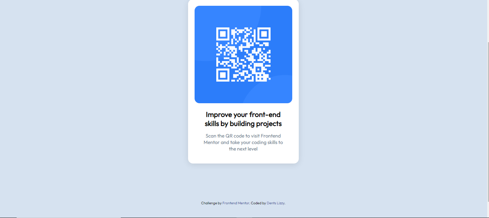

# Frontend Mentor - QR code component solution

This is a solution to the [QR code component challenge on Frontend Mentor](https://www.frontendmentor.io/challenges/qr-code-component-iux_sIO_H). Frontend Mentor challenges help you improve your coding skills by building realistic projects.

## Table of contents

- [Overview](#overview)
  - [Screenshot](#screenshot)
- [My process](#my-process)
  - [Built with](#built-with)
  - [What I learned](#what-i-learned)
  - [Continued development](#continued-development)
- [Author](#author)
- [Acknowledgments](#acknowledgments)

## Overview

### Screenshot



## My process

### Built with

- Semantic HTML5 markup
- CSS custom properties
- Flexbox

### What I learned

Well, i can't say i'm done learning but i learned a few things and recalled a few that i thought i forgot about. I learned about github pages, i learned how to commit and push my code properly and i recalled how to use some css properties.
To see how you can add code snippets, see below:

```html
<div class="attribution">
  Challenge by
  <a href="https://www.frontendmentor.io?ref=challenge" target="_blank"
    >Frontend Mentor</a
  >. Coded by <a href="#">Dents Lizzy</a>.
</div>
```

```css
.container {
  background-color: white;
  border-radius: 15px;
  padding: 20px;
  text-align: center;
  box-shadow: 0 4px 20px rgba(0, 0, 0, 0.1);
  max-width: 300px;
  width: 100%;
  margin: 100px;
}
```

### Continued development

As a beginner, there's a lot to still learn but i would like to learn how to use :root and some other interesting css styles that saves you the stress of too much code. I also had issues with the github page setup because it kept showing 404, page not found.So i had to bring them out of the folder.

## Author

- Frontend Mentor - [@Denlikaa](https://www.frontendmentor.io/profile/Denlikaa)

## Acknowledgments

I would like to thank Donia Hussain, her solution helped me have an idea on how to go about this project. i also want to thank ChatGpt for the help when i got confused about certain css styles.
